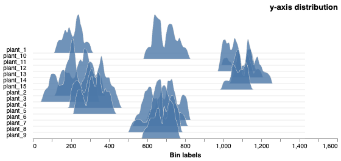
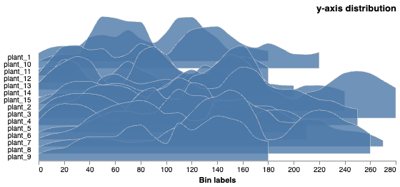

## Analyze the Spatial Distribution of Object(s)

Spatial distribution analysis outputs numeric properties describing the pixel distribution in the X or Y dimension for plants,
roots, flowers, etc. In particular, this application can be useful for analyzing the distribution of roots in soil. 
 
**plantcv.analyze.distribution**(*labeled_mask, n_labels=1, direction="down", bin_size=100, hist_range="absolute", label=None*)

**returns** Ridgeline plot of histograms of pixel distributions in the X or Y dimensions

- **Parameters:**
    - labeled_mask - Labeled mask of objects from any binary mask or from [`pcv.create_labels`](create_labels.md).
    - n_labels - Optional parameter, total number expected individual objects (default = 1).
    - direction - Optional parameter, image axis to calculate the distribution of object pixels ("down" or "across"; default = "down").
    - bin_size - Optional parameter, defines the size of the bin in pixels in the X direction. 
    - hist_range - Optional parameter, the histogram range can be set to the image dimensions ("absolute") or "relative" to each object (default = "absolute").
    - label - Optional label parameter, modifies the variable name of observations recorded. Can be a prefix or list (default = pcv.params.sample_label).
- **Context:**
    - Used to output distribution of object(s) (labeled regions) in the X or Y dimensions of an image. 
- **Example use:**

- **Output data stored:** Data ('x_frequencies', 'y_frequencies', 'x_distribution_mean', 'x_distribution_std', 'x_distribution_median', 'y_distribution_mean', 'y_distribution_std', 'y_distribution_median') 
    automatically gets stored to the [`Outputs` class](outputs.md) when this function is ran. 
    These data can always get accessed during a workflow (example below). For more detail about data output see [Summary of Output Observations](output_measurements.md#summary-of-output-observations)

**Labeled mask (colorized for effect)**


```python

from plantcv import plantcv as pcv

# Set global debug behavior to None (default), "print" (to file), 
# or "plot" (Jupyter Notebooks or X11)

pcv.params.debug = "plot"
# Optionally, set a sample label name
pcv.params.sample_label = "plant"

# Calculate the distribution along the y-axis ("down")
# The histogram scales are absolute, on the image coordinate scale
y_dist_chart = pcv.analyze.distribution(labeled_mask=mask, n_labels=num, bin_size=10)

# Access data stored out from analyze.distribution
y_distribution_mean = pcv.outputs.observations['plant_1']['y_distribution_mean']['value']

# Calculate the distribution along the y-axis ("down")
# The histogram scales are relative, on the object's coordinate scale
y_dist_chart = pcv.analyze.distribution(labeled_mask=mask, n_labels=num, bin_size=10, hist_range="relative")


```

**Histograms of Y distribution values on the image scale**


**Histograms of Y distribution values on each object's scale**


**Source Code:** [Here](https://github.com/danforthcenter/plantcv/blob/main/plantcv/plantcv/analyze/distribution.py)
