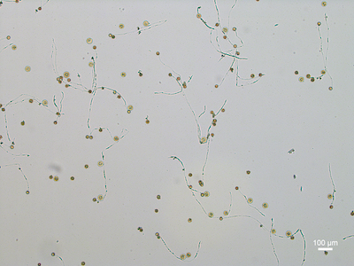

## Click and count objects 

`ClickCount` is a class that allows users to interactively count objects and other annotation tasks.

*class* **plantcv.annotate.ClickCount**(*img*, *figsize*=(12, 6))

- img - Image data
- figsize - Interactive plot figure size (default = (12,6))

### Attributes
**img**: input image.

**points**: a dictionary of coordinates for every class.

**colors**: a dictionary of colors for every class.

**counts**: a dictionary of count for every class.

**figsize**: figure size.

**events**: a list of events.

**label**: current label.

**color**: current color.

**view_all**: a flag indicating whether or not view all labels.

**fig**: matplotlib figure.

**ax**: matplotlib axis.

**p_not_current**: a list of matplotlib patches that are not current label.

### Methods
**import_coords(*coords*, *label*="total")**

Import coordinates from a list of coordinates.

- Parameters:
    - coords - a list of available coordintes.
    - label - class label for imported coordinates. By default `label="total`.

**view(*label*="total", *color*="c", *view_all*=False)**

View marked image, and update markers if needed.

- Parameters:
    - label - class label to show on the marked image. By default `label="total`.
    - color - desired color to show the class. By default `color="c"`.
    - view_all - a flag indicating whether to show markers for all classes or not. 
  
**save_coords(*coord_file*)**

Save the collected coordinates to a JSON file.

- Parameters:
    - coord_file - (json) file name to save the coordinates of collected points. 

**onclick(*event*)**

Handles mouse click events.

**correct**(*bin_img*, *bin_img_recover*, *coords*)

Make corrections to annotations 

**returns** recovered image

- **Parameters:**
    - bin_img - binary image, image with selected objects (e.g. mask output of [`pcv.annotate.detect_discs`](annotate_detect_discs.md))
    - bin_img_recover - binary image, image with all potential objects (binary image to recover objects from)  
    - coords - list of coordinates of 'auto' detected points (e.g. coordinate output of `pcv.annotate.detect_discs`)
- **Context:**
    - Make corrections to the number of objects in a binary image with information from the ClickCount class object instance (both remove and recover objects). Also corrects the ClickCount object instance with coordinates at the center of each object (rather than click location).

**file_import**(*filename*)

Import coordinates from file to a ClickCount object instance

- **Parameters:**
    - filename - path to a coordinates file  
- **Context:**
    - Loads coordinates from a file (probably created with the `.save_coords` method) to ClickCount object instance

- **Example use:**
    - Below

- **Note**: used in Jupyter notebook.

**Input image**



**Mask of automated detected objects**


```python
# include the line of code below to allow interactive activities
%matplotlib widget

from plantcv import plantcv as pcv

# Set global debug behavior to None (default), "print" (to file),
# or "plot"
pcv.params.debug = "plot"

# initialization
counter = pcv.annotate.ClickCount(img)
# define coordinate list 
coords = [(158, 531), (265, 427), (361, 112), (500, 418)] 
# import coordinates (if available)
counter.import_coords(coords=coords, label="total")
# view "total" class
counter.view(label="total", color="c", view_all=True)
# view "c1" class
counter.view(label="c1", color="r", view_all=True)

```

**View markers for `total` class**


(When interactivity is enabled, you can left click to add markers for the class, or right click to remove markers)

**View markers for `c1` class**


**Source Code:** [Here](https://github.com/danforthcenter/plantcv/blob/main/plantcv/plantcv/annotate/classes.py)
