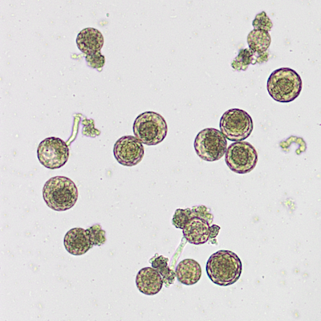
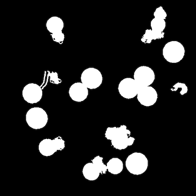
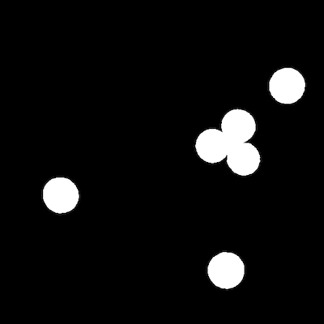
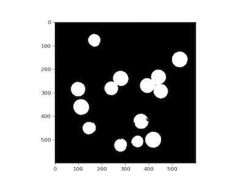

## Recover, Correct, or Remove Points from ClickCount 

Correct ClickCount Object Mask

**plantcv.annotate.clickcount_correct**(*bin_img*, *bin_img_recover*, *counter*, *coor*)

**returns** recovered image, corrected ClickCount object

- **Parameters:**
    - bin_img - binary image, image with selected objects (e.g. mask output of [`pcv.annotate.detect_discs`](annotate_detect_discs.md))
    - bin_img_recover - binary image, image with all potential objects (binary image to recover objects from)  
    - counter - ClickCount class object with points interactively corrected by the user
    - coor - list of coordinates of 'auto' detected points (e.g. coordinate output of `pcv.annotate.detect_discs`)
- **Context:**
    - Make corrections to the number of objects in a binary image with information from the ClickCount class object (both remove and recover objects). Also returns a corrected ClickCount object with coordinates at the center of each object (rather than click location).
- **Example use:**
    - Use in pollen germination detection

**Original RGB image**


  
**Thresholded and Filled Mask image**



**Detect Disc Output**




```python

from plantcv import plantcv as pcv

# Set global debug behavior to None (default), "print" (to file), 
# or "plot" (Jupyter Notebooks or X11)

pcv.params.debug = "plot"

# Apply binary 'white' mask over an image. 
recovered_img, counter1 = pcv.annotate.clickcount_correct(bin_img=pollen_all_mask, bin_img_recover= pollen_detectdisc_mask, counter=counter, coor=coor)

```

**Recovered Objects Image**




**Source Code:** [Here](https://github.com/danforthcenter/plantcv/blob/main/plantcv/plantcv/annotate/clickcount_correct.py)
