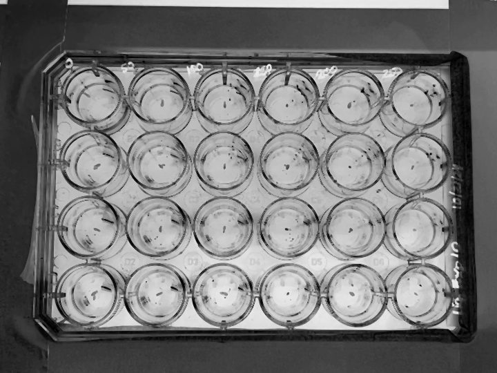
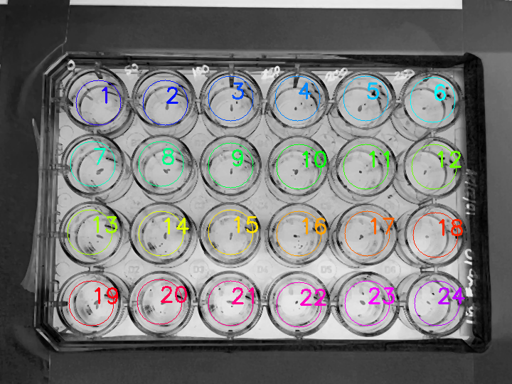

## Autodetect Cicular Regions of Interest (ROI) 

**plantcv.roi.auto_wells**(*gray_img, *)

**returns** roi_objects

- **Parameters:**
    - gray_img            = Gray single channel image data
    - mindist             = minimum distance between detected circles
    - candec              = higher threshold of canny edge detector
    - accthresh           = accumulator threshold for the circl centers
    - minradius           = minimum circle radius
    - maxradius           = maximum circle radius
    - nrows               = expected number of rows
    - ncols               = expected number of columns
    - radiusadjust        = amount to adjust the average radius, this can be desirable if you want ROI to sit inside a well, for example (in that case you might set it to a negative value).
- **Context:**
    - Uses a Hough Circle detector to find circular shapes, then uses a gaussian mixture model to sort found circular objects so they are ordered from 
    top left to bottom right. We assume that circles are of approximately equal size because we calculate an average radius of all of the found circles.
    The average radius size can be adjusted with the radius adjust parameter, for example in the case that you'd like the ROI to sit inside of the well.

**Reference Image**



```python

from plantcv import plantcv as pcv

# Set global debug behavior to None (default), "print" (to file), 
# or "plot" (Jupyter Notebooks or X11)
pcv.params.debug = "plot"

# Detect Circular Shapes and Use as ROIs
rois1 = pcv.roi.auto_wells(gray_img=gray_img, mindist = 20, candec = 50, 
accthresh = 30, minradius = 40, maxradius = 50, nrows=4, ncols=6, radiusadjust=-10)
                                      
```

**Grid of ROIs**



**Source Code:** [Here](https://github.com/danforthcenter/plantcv/blob/main/plantcv/plantcv/roi/roi_methods.py)
