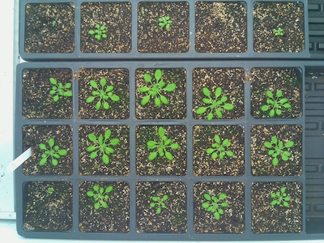

## Create Multiple Regions of Interest (ROI) 

**plantcv.roi.multi**(*img, coord, radius=None, spacing=None, nrows=None, ncols=None*)

**returns** roi_objects

- **Parameters:**
    - img            = Input image data.
    - coord          = Two-element tuple of the center of the top left object.
    - radius         = Optional parameter to specify the radius of the ROIs.
    - spacing        = Two-element tuple of the horizontal and vertical spacing between ROIs.
    - nrows          = Number of rows in ROI layout.
    - ncols          = Number of columns in ROI layout.
- **Context:**
    - Used to define multiple regions of interest in the same image. Users can either specify a
      starting coordinate (`coord`), number of row and columns, and spacing to create a grid of ROIs,
      or a custom list of coordinates that specify the centers of the ROIs. Providing a custom list 
      of coordinates (list of tuples) is useful for missing plants or any arrangement that isn't 
      a perfect grid. Returns an Objects instance that can be used in downstream steps. The analysis
      image includes a number representing ROI order. 

**Reference Image**



```python

from plantcv import plantcv as pcv

# Set global debug behavior to None (default), "print" (to file), 
# or "plot" (Jupyter Notebooks or X11)
pcv.params.debug = "plot"

# Make a grid of ROIs 
rois1 = pcv.roi.multi(img=img1, coord=(25,120), radius=20, 
                                      spacing=(70, 70), nrows=3, ncols=6)

# Specify a list of coordinates of desired ROIs 
rois2 = pcv.roi.multi(img=img1, coord=[(25,120), (165,260), (310, 260)], 
                                      radius=20)
                                      
```

**Grid of ROIs**


**Custom list of ROIs** 


### Next steps:

This function returns an Objects dataclass, which can be used with [create_labels](create_labels.md) to createa a labeled
mask for use with analysis functions.

```python
lbl_mask, n_lbls = pcv.create_labels(mask=mask, rois=rois)

# Analyze the shape of each plant 
shape_img = pcv.analyze.size(img=img_copy, labeled_mask=lbl_mask, n_labels=n_lbls, label="plant")

# Print out a text file with shape data for each plant in the image 
pcv.outputs.save_results(filename=filename)

```

**Image with shape analysis characteristics on each plant** 


**Source Code:** [Here](https://github.com/danforthcenter/plantcv/blob/main/plantcv/plantcv/roi/roi_methods.py)
